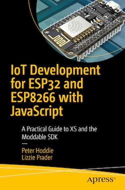

# IoT Development for ESP32 and ESP8266 with JavaScript
### A Practical Guide to XS and the Moddable SDK

by Peter Hoddie and Lizzie Prader

## About

This repository contains the source code for example apps from *IoT Development for ESP32 and ESP8266 with JavaScript*.

You can purchase the book from [Keplers Books](https://www.keplers.com/book/9781484250693), [Amazon](https://www.amazon.com/IoT-Development-ESP8266-ESP32-JavaScript/dp/1484250699/ref=sr_1_2), and [Moddable](https://www.moddable.com/book#purchase).

## Table of Contents

* Chapter 1 - [Getting Started](./ch1-gettingstarted)
* Chapter 2 - JavaScript for Embedded C and C++ Programmers[[1](#footnotes)]
* Chapter 3 - [Networking](./ch3-network)
* Chapter 4 - [Bluetooth Low Energy (BLE)](./ch4-ble)
* Chapter 5 - [Files and Data](./ch5-files)
* Chapter 6 - [Hardware](./ch6-hardware)
* Chapter 7 - [Audio](./ch7-audio)
* Chapter 8 - Graphics Fundamentals[[2](#footnotes)] 
* Chapter 9 - [Drawing Graphics with Poco](./ch9-poco)
* Chapter 10 - [Building User Interfaces with Piu](./ch10-piu)
* Chapter 11 - [Adding Native Code](./ch11-native)

> [1][2] *These chapters contain short examples in the text, but not in this repository.* 

## Links

**Twitter**

* Peter Hoddie - [@phoddie](https://twitter.com/phoddie) 
* Lizzie Prader - [@lizzieprader](https://twitter.com/lizzieprader) 
* Moddable - [@moddabletech](https://twitter.com/moddabletech)

**Moddable**

* [Moddable website](https://www.moddable.com)
* [Moddable SDK](https://github.com/Moddable-OpenSource/moddable/)

## Moddable Six Support!
[Moddable Six](https://www.moddable.com/moddable-six) is an  advanced display powered by the ESP32-S3. It is fully compatible with the examples in our book. This powerful development board replaces Moddable Two. Moddable Six includes a built-in speaker, so you easily use the audio examples in Chapter 7. It also features a faster display, more responsive touch, more RAM, and larger flash storage.

## Nordic nRF52 Support!

The Moddable SDK 4.0 has added support for the Nordic nRF52 microcontroller. The ultra-low power nRF52 with integrated BLE allows projects to run on a coin cell battery.

The Moddable SDK APIs are compatible across ESP32, ESP8266, and nRF52 microcontrollers. Therefore, the majority of the content of our book applies to nRF52 too. However, networking (Chapter 3) and audio (chapter 6) are not available on nRF52.

[Moddable Four](https://www.moddable.com/moddable-four) is an nRF52 development board with BLE, a display, jog dial, and accelerometer. It is a great place to explore nRF52 development in JavaScript.

## Questions? We're here to help

If you have a question or comment about the examples or content in this book, we recommend you send us a message in [our Gitter chatroom](https://gitter.im/embedded-javascript/moddable) or [open an issue](https://github.com/Moddable-OpenSource/iot-product-dev-book/issues) in this repository. Also see the [corrigendum](./corrigendum.md) for corrections to the text.

If you're having technical issues with the Moddable SDK—for example installing the SDK, building and flashing examples, or using the debugger—please open an issue in the [Moddable SDK repository](https://github.com/Moddable-OpenSource/moddable/).
